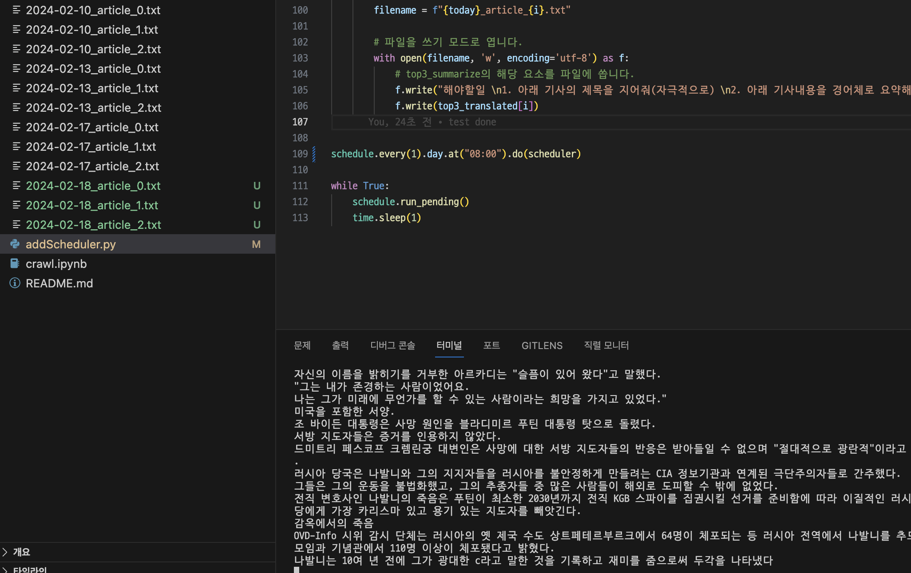

# DailyFinancialNews

매일 9시마다 해외 경제 뉴스 기사를 크롤링해서 파파고로 번역한 뒤에 내 로컬에 저장해주는 프로그램.

Selenium을 써보고 싶어 만들어봤다.

원래 계획은 GPT API를 사용해 파파고에서 번역된 기사를 요약해 저장하려 했으나, GPT API를 쓰려면 선 결제금이 있어 GTP는 생략했다.

# 구조

1. investing.com의 Popular News링크에서 탑 3 뉴스를 크롤링해와 텍스트를 저장한다.
2. 파파고에 접속해 html ID 중 txtSource를 찾아 저장해두었던 텍스트를 집어 넣는다. 
3. 번역이 진행될때까지 기다렸다가, 번역된 글을 txtTarget 이란 ID에서 찾아 가지고 온다.
4. 가지고 온 텍스트를 로컬에 txt파일로 저장한다.
5. 스케줄러를 이용해 1~4의 과정을 매일 아침 8시에 실행시켜 아침마다 확인할 수 있다.

# Example

다음날 아침 새로운 기사가 추가되었다.

# 개선점
생각해보니 개인 블로그는 markdown으로 로컬에 저장하고 깃허브에 push하면 html로 변환되는 형식으로 작동하는데, 

markdown으로 저장되도록 하면 별도 작업 없이 깃허브에 push하면 블로그에 업로드 될 것 같다.

